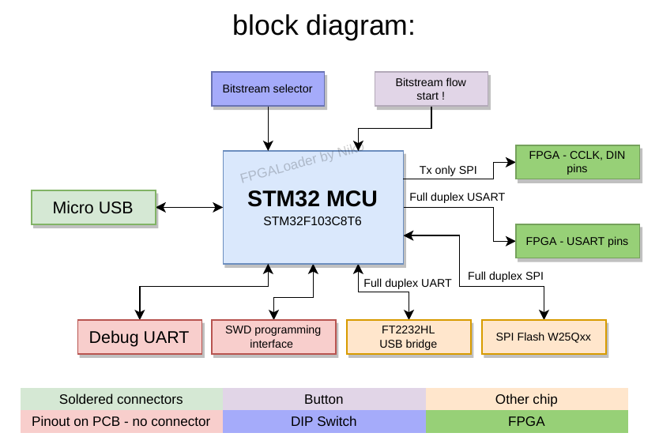

# FPGAConfigurationSubsystem

It's a circuit which sets up an FPGA with a bitstream saved in SPI FLASH connected to MCU.   

   

## What chips are used?

- STM32F103C8T6 MCU   
- W25Q32/W25Q64/W25Q128 SPI Flash   

## How does it work?

When FPGA board is powered on, You can choose one bitstream from a few saved on a SPI FLASH.   
Choosing bitstream can be done:   
- by pressing one of few buttons   
or   
- by setting a DIP switch and pressing a button   
it is not defined Yet.   

## What application will be able to do using FCS?
PC can communicate with FCS directly using USB-CDC or indirectly(UART) with FT2232HL converter. It is able to:   

- Writing into a SPI Flash(up to 4096 Bytes into specified sector)   
- Assignment of memory part(specifying start sector and ammout of Bytes) for
each FPGA bitstream   
- Choosing bitstream to send into FPGA    
- Triggering sending bitstream into FPGA   
- Communicate with FPGA using UART <-> STM32 <-> USART <-> FPGA(only after fpga configuration)   

App on PC can also trigger bitstream loading(using USB-CDC or UART).   

## DONE
- Written some firmware which allows user to change content of SPI FLASH over USB-CDC
